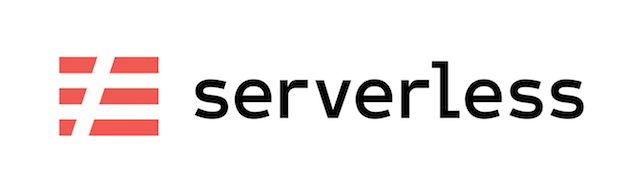

# amaysim/serverless

[](http://serverless.com)

[](http://www.serverless.com)

Docker image containing NodeJS, Serverless Framework and Yarn.

## Usage

### Build Locally

If you want to build and use your own local image

```bash
# build image locally
$ make build
# go inside the container
$ make shell
```

## Example

`example/apigw` is an example on how to use `amaysim/serverless`.

## Update Docker image

### New version of Serverless Framework

1. Change `SERVERLESS` of `Dockerfile`
2. Change `SERVERLESS_VERSION` of `Makefile`
3. Change version of docker-serverless in `example/apigw/docker-compose`
3. Build and test locally (test also the apigw example)
4. Commit and push the changes
5. Tag the commit with the command `$ make tag`
6. Go to [hub.docker.com](https://hub.docker.com/r/amaysim/serverless/)
7. In `Build Details` tab, you should now see the new tag kicking off

### Fix for the current version

1. Do the fixes you want to do
2. Build and test locally (test also the apigw example)
3. Commit and push the changes
4. Run `$ make tag`
5. Go to [hub.docker.com](https://hub.docker.com/r/amaysim/serverless/)
6. In `Build Details` tab, you should now see build the tag kicking off

Docker image
------------

The Docker image has the following:

- Node 8.4 (Alpine): we leverage Babel to be compatible with AWS Lambda runtime
- [Serverless Framework v1.26.0](https://serverless.com)
- [yarn](https://github.com/yarnpkg/yarn)
- zip: handy to zip your own serverless artefact
- [AWS CLI](https://github.com/aws/aws-cli): required by some Serverless plug-ins to work
